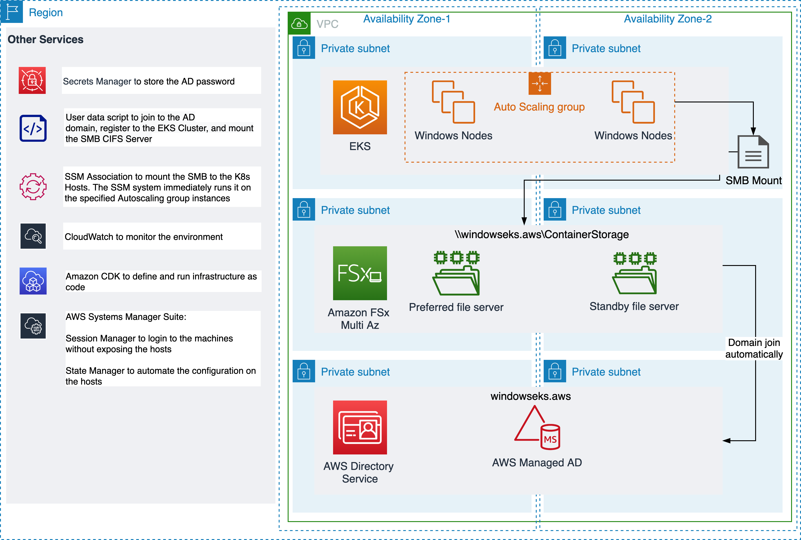

# EKS With Windows Nodes integrated with Active Directory and Shared Storage (Amazon FSx)

## Architecture



## How to use the code

```bash
git clone <repoURL>

# Install dependencies
npm install

# Run the code and create cloudformation templates
cdk ls 

# Make the relevent code changes

# Deploy the code
cdk deploy
```

## CDK Constructs 

### **VpcMad**

This construct creates Amazon VPC, Amazon Managed AD, Secret for the domain Admin stored in Secrets Manager and Route 53 forward rule for the domain.

The construct provides way to customize configuration and smart defaults for the infrastructures.

Example:

```typescript
const vpc_infrasracture = new VpcMad(this, "Main-Infra", { domain_name: "windowseks.aws"});
```

### **WindowsFSxMad**

This construct extends the VpcMad to allow FSx integration.

Example:

```typescript
const vpc_infrasracture = new WindowsFSxMad(this, "Main-Infra", {
	FSxMBps: 128, 
	FSxSize: 100, 
	MultiAZ: false, 
	FSxInPrivateSubnet: true, 
	domain_name: "windowseks.aws"
});
```

### **WindowsEKSCluster** 

This stack take the WindowsFSxMad stack as input and creates the EKS cluster with permissions to operate EKS clusters.

Example:

```typescript
const eks_infra = new WindowsEKSCluster(this, 'EKS-Infra',vpc_infrasracture);
```

### **WindowsEKSNodes**

The stack creates the Windows Autoscaling group with domain join script and the SSM Documents for gMSA and Global Mapping.

Example:

```typescript
const eks_nodes = new WindowsEKSNodes(this, 'EKS-Nodes',
	vpc_infrasracture, 
	eks_infra);
```

### **WindowsWorker**

The stack creates Windows Server with the latest AMI and joined the machine to the domain. It is possible to send Powershell commands or connect and work from the machine. 

Example:

```typescript
const Worker = new WindowsWorker(this, 'WindowsWorker',{
	vpc: vpc_infrasracture.vpc, 
	madObject: vpc_infrasracture.ad);
```

## Deployment file for the application

```yaml 
spec:
 securityContext:
  windowsOptions:
   gmsaCredentialSpecName: gmsawebapp01
 containers:
 - name: windows-server-iis
   image: mcr.microsoft.com/windows/servercore/iis
   ports:
   - name: http
     containerPort: 80
   imagePullPolicy: IfNotPresent
   command:
   - powershell.exe
   - -command
   - "Invoke-WebRequest -UseBasicParsing -Uri 'https://dotnetbinaries.blob.core.windows.net/servicemonitor/2.0.1.6/ServiceMonitor.exe' -OutFile 'C:\\ServiceMonitor.exe'; Invoke-WebRequest -UseBasicParsing -Uri 'http://media.corporate-ir.net/media_files/IROL/17/176060/Oct18/Amazon%20logo.PNG' -OutFile 'c:\\folderInsidePod\\amazon.png'; echo '<html><body><br/><br/><marquee><H1>Hello EKS with Amazon FSx and Managed AD!!!</H1></marquee></body></html>' > C:\\inetpub\\wwwroot\\index.html; C:\\ServiceMonitor.exe 'w3svc';"
  volumeMounts:
   - mountPath: c:\folderInsidePod
     name: testmount
 volumes:
  - name: testmount
    hostPath: 
     path: G:\folder1
     type: Directory
 nodeSelector:
  kubernetes.io/os: windows
```
[See full Yaml](lib/hello-iis/windows_server_iis.yaml)

Important parameters:

- securityContext with gmsaCredentialSpecName: Map a specific Cred file to the Pod , see example [specfile](lib/gMSA/gmsa-example.yaml). (The file is generated with the script provided in step "Generate the gMSA spec file for Kubernetes cluster" in the [installation guide](Installation_guide.md))
- volumeMounts : Mount the Global Mapping to the Pod
- hostPath : Map between the Global Mapping to the Pod
- nodeSelector : Select windows hosts
 
# Automation with CDK

The steps in high level (the manual steps are `marked`):

1. Infrastructure
	- Create and configure Amazon VPC
	- Create and configure Managed AD in two Availability zones
	- Generate and store Domain admin password in Secrets Manager
	- Create Amazon FSx file system in two Availability zones with Managed AD
	- `Create the gMSA Account in the AD` (Script provided)
	- `Create a folder on the FSx for the SMB Share with the AD gMSA` (Script provided)
	- Create and configure Route 53 Resolver to resolve Active Directory domain name from the VPC
2. Kubernetes Infrastructure
	- Create EKS Cluster
	- Deploy two Linux machines with Managed-NodeGroup
	- Configure Permissions & Roles (IAM Roles)
	- Map Kubernetes groups to the EC2 Instance roles
	- `Installing eksctl on local machine` (Script provided)
	- `Map IAM Users to mapRoles` (Optional)
	- `Enable Windows Support with eksctl` (Script provided)
3. Adding Capacity
	- Configure Launch Template with user-data scripts
	- Create Autoscaling Group (ASG) with the launch template
	- Connect the Instances to the AD Domain
	- Map the CIFS to the host with SMB Global Mapping (with SSM document and State manager)
	- Connect the Nodes to the EKS Cluster (with SSM document)
	- Connect the ASG to the Cluster (IAM roles)
4. Scheduling Pods
	- `Deployment Yaml`
	- `Service Yaml`

Instance lifecycle



[Full Installation guide](Installation_guide.md)
